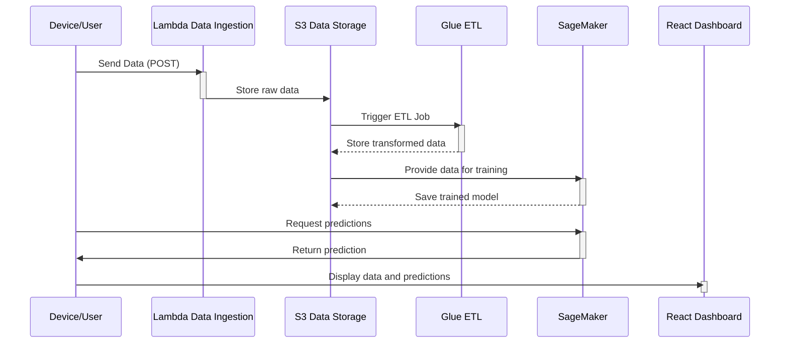

# 🚀 Serverless Data Engineering Pipeline

A **scalable, serverless data engineering pipeline** designed for **real-time data ingestion, transformation, and machine learning**. Built on **AWS**, this architecture enables automated ETL, real-time processing, and seamless data visualization.

---

## 🌟 Key Features

✔️ **Real-time data ingestion** via REST API or streaming sources.  
✔️ **Automated data transformation** into structured datasets.  
✔️ **Machine Learning integration** with SageMaker for real-time predictions.  
✔️ **Interactive dashboard** for monitoring and data visualization.  
✔️ **Serverless architecture** for scalability and cost efficiency.  
✔️ **Multi-cloud support** for backup and redundancy.  

---

[](https://aws.amazon.com/](https://github.com/ricscar2570/portfolio/blob/main/Serverless%20Data%20Engineering%20Pipeline/Serverless.png?raw=true)) 
[](LICENSE)
[](https://github.com/your-repo)





```Folder structure
├── src/
│   ├── lambda/
│   │   ├── data_ingestion.py
│   │   ├── prediction_service.py
│   ├── glue/
│   │   ├── transform_data.py
│   │   ├── prepare_ml_dataset.py
│   ├── sagemaker/
│   │   ├── train_model.py
│   │   ├── deploy_model.yaml
│   ├── frontend/
│   │   ├── src/
│   │   │   ├── components/
│   │   │   │   ├── Dashboard.js
│   │   │   │   ├── Upload.js
│   │   │   ├── App.js
│   │   │   ├── index.js
├── README.md
├── LICENSE

```

# First Mock-up 
> 


## 🏗️ Project Architecture  

### **System Diagram**
A high-level overview of how various AWS services interact within the pipeline.

- **AWS Lambda**: Handles data ingestion and real-time predictions.
- **Amazon S3**: Stores raw data, transformed datasets, and machine learning-ready data.
- **AWS Glue**: Cleans and processes raw data for machine learning.
- **Amazon SageMaker**: Trains and deploys models for real-time inference.
- **Amazon Kinesis**: Enables real-time streaming data processing.
- **React Dashboard**: Provides a user-friendly interface for monitoring and visualization.
- **Prometheus & Grafana**: Monitor pipeline performance and detect anomalies.

---

## 🧩 Project Components  

### **1. Lambda Functions**
📥 **Data Ingestion**: Collects data from various sources and stores it in S3.  
🤖 **Prediction Service**: Calls SageMaker to return real-time predictions.  

### **2. Glue ETL Scripts**
🔄 **Transform Data**: Cleans and structures raw data.  
🧹 **Prepare ML Dataset**: Generates structured CSV datasets for machine learning.  

### **3. SageMaker**
🏋️ **Training**: Trains an ML model (e.g., XGBoost, Linear Regression).  
⚡ **Endpoint Deployment**: Deploys the trained model for real-time inference.  

### **4. Real-Time Processing**
📊 **Amazon Kinesis**: Enables low-latency stream processing for real-time applications.  

### **5. Front-End**
📊 **Dashboard**: Visualizes predictions and processed data with interactive charts.  
📁 **Upload Multi-file**: Supports simultaneous file uploads for batch processing.  

---

## 🌈 Technologies Used  

  
  
  
  

- **AWS Services**: Lambda, S3, Glue, SageMaker, Kinesis, Step Functions, CloudWatch, SNS.  
- **Frameworks**: React.js (dashboard), PySpark (ETL).  
- **Languages**: Python (ETL, Lambda), JavaScript (Frontend).  

---

## 🚀 How It Works  

The **Serverless Data Engineering Pipeline** processes, transforms, and analyzes data from **various data sources** in real time. It automates the entire data flow from ingestion to machine learning predictions.

1. **Data Collection**: Devices and applications send data to an AWS Lambda-managed API endpoint.  
2. **Storage**: The data is stored in Amazon S3 as raw JSON or CSV.  
3. **ETL Processing**: AWS Glue cleans, structures, and prepares the data for ML.  
4. **Machine Learning Training**: SageMaker trains models on transformed datasets.  
5. **Real-Time Predictions**: Lambda invokes SageMaker to get real-time predictions.  
6. **Data Visualization**: The React-based dashboard displays live data and ML insights.  

---

## 📈 Charts & Visualizations  

📊 **Predictions Over Time** – Real-time chart displaying predictions.  
📊 **Data Distribution** – Insights into the dataset’s structure and anomalies.  

---

## 🔧 Setup  

### **Prerequisites**
- **AWS CLI**: Configured with valid credentials.  
- **Node.js**: Required for the React frontend.  
- **Python 3.x**: Required for Lambda functions and Glue ETL scripts.  

### **Deployment Steps**
1️⃣ Clone the repository:

```sh
git clone https://github.com/your-repo/serverless-pipeline.git
cd serverless-pipeline

2️⃣ Configure AWS CLI:

aws configure

3️⃣ Install dependencies:

For Lambda and Glue:

pip install -r requirements.txt

For Frontend:

cd frontend
npm install

4️⃣ Deploy with AWS CloudFormation:

aws cloudformation deploy --template-file template.yaml --stack-name serverless-pipeline

5️⃣ Start the frontend:

npm start

📌 Usage Examples
Data Ingestion Request

curl -X POST -H "Content-Type: application/json" -d '{"device_id": "123", "value": 42}' https://your-api-endpoint/data-ingestion

Real-Time Prediction Request

curl -X POST -H "Content-Type: application/json" -d '{"feature_value": 50}' https://your-api-endpoint/predict

🤝 Contributing

Want to contribute? Follow these steps: 1️⃣ Fork the repository.
2️⃣ Create a new branch:

git checkout -b feature-new-feature

3️⃣ Commit your changes:

git commit -m "Added a new feature"

4️⃣ Push to the branch:

git push origin feature-new-feature

5️⃣ Open a Pull Request.
📝 License

This project is licensed under the MIT License. See the LICENSE file for details.
📧 Contact

💬 Questions? Suggestions? Contact us!
📧 Email: ricscar@gmail.com
🌐 Website: riccardoscaringi.eu
